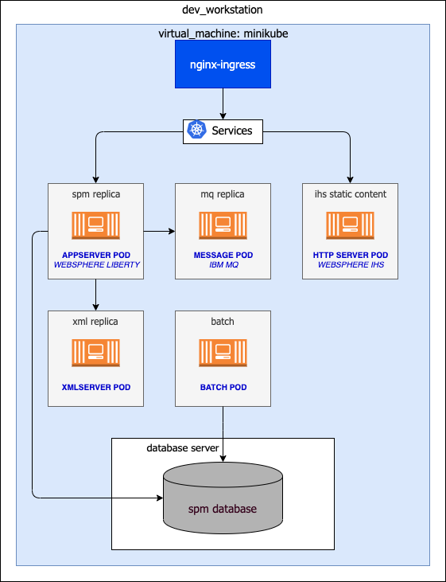
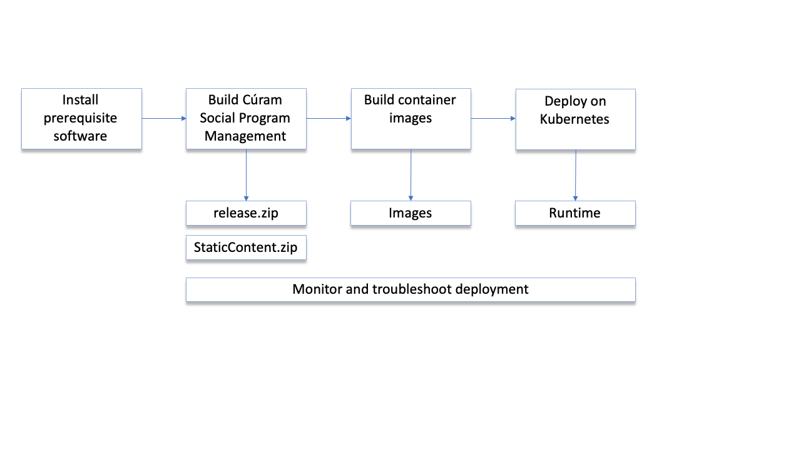

# IBM Cúram Social Program Management Containerization Runbook

Welcome to the developer enablement documentation for IBM Cúram Social Program Management (SPM) on Kubernetes.
This runbook shows you how to containerize an instance of SPM and deploy it on a Kubernetes environment by using Minikube.
Minikube is a variant of Kubernetes that runs a single-node cluster inside a virtual machine (VM) on your laptop.

The document is designed for first-time users of Helm, Minikube, and Kubernetes.

The procedure that is described uses a minimal architecture, the intent is to get you familiar with using the main artifacts needed to run SPM on Kubernetes. The example architecture is described in figure 1:

*Figure 1: Example architecture*

The architecture is defined by a Kubernetes environment (contained in a virtual machine) composed of the following elements:

* An IBM WebSphere Liberty based pod that contains the Cúram EAR file.
* A pod with an IBM MQ Server configured as the message engine to support JMS-based deferred processing in SPM.
* A pod that contains the XML server.
* A pod that runs batch processes.

This environment is linked to an external IBM Db2 or Oracle database.

For the Kubernetes cluster, this guide uses Minikube. Minikube can easily run on a developer computer making it convenient to describe the application flow.

The development path is described in figure 2.

* Create a build and deployment environment for SPM.
* Build SPM to deploy it on Kubernetes on Minikube.
* Create the Docker images for SPM.
* Deploy SPM Docker images to Kubernetes on Minikube.
* Troubleshoot SPM when deployed in Kubernetes.

*Figure 2: Process summary*

Note: The implementation of SPM that is described in this runbook uses the following .ear files only:

* curam.ear
* curamServerCode.ear

The document assumes that the steps to build the containers and run MiniKube are run on a development machine, preferably a Red Hat or OSX machine.
The steps related to [build the Cúram environment](01-PREREQ/spm-build) can be executed on a separate machine.
