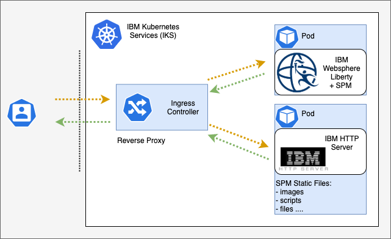

## Deploy SPM Static Content in IBM® Kubernetes Services (IKS)

The static content server feature allows static content to be hosted on a separate web server.
This feature allows the web server that hosts the static content to be tuned for the static content and reduces the load on the main SPM application servers.

<Caption>

*Figure 1:* SPM on Kubernetes - static content

</Caption>

As outlined in Figure 1, SPM static content runs in its own pod. By running SPM static content in its own pod, the pod can leverage the benefits of flexibility, elasticity, efficiency and the strategic value offered by cloud native architecture.

While it is technically possible to have SPM static content on the ingress controllers (for example, ALBs), this is not a recommended approach. The ingress controller is not designed to serve static content.

Application workloads should be isolated from ingress workloads.
The ingress controller should have the unique role of handling the ingress rules that are defined in your cluster, and should be treated as part an infrastructure component of your cloud native architecture.

Serving static content is a fundamental part of your application, and the static content should be served in a pod on your application worker nodes.

<InlineNotification>

**Note:** For more infomation about how to create an SPM static content container to run on Kubernetes, see [Building the Docker® images](/03-build-images/build_images)

</InlineNotification>

<InlineNotification>

**Note:** For more information, see Static Content Server in the [Knowledge Center](https://www.ibm.com/support/knowledgecenter/SS8S5A_7.0.10/com.ibm.curam.content.doc/WebClientReference/r_WEBCREF_Development1Staticcontentserver1.html)

</InlineNotification>
