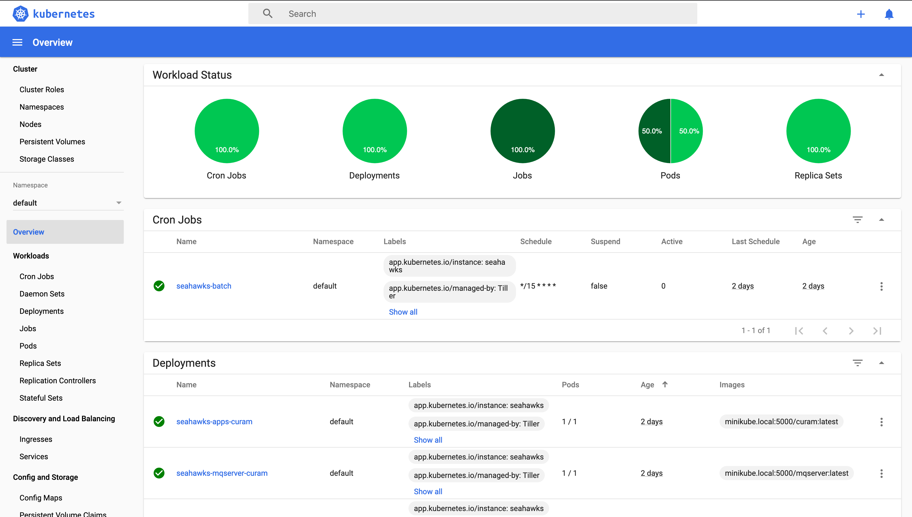
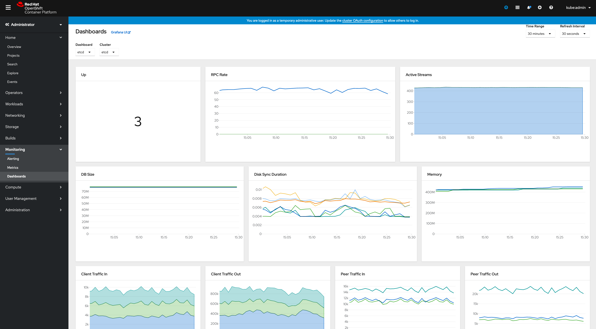

You can interrogate a Kubernetes system to debug or verify its status in the following ways:

* View the Minikube dashboard or the CodeReady Containers console
* View pod status and logs
* Log in to a pod to investigate its status
* Modify a Kubernetes object

## Minikube dashboard

The dashboard add-on is enabled by default in Minikube and is used to verify the health of the system.
Because Minikube is a minimal environment, the dashboard add-on doesn't have the full capability of the dashboard in a fully deployed Kubernetes cluster. However, the dashboard shows the most important data.

Use the dashboard to list the Kubernetes objects, including the status and names of the pods, and more information such as how long the pods are running.

Start the dashboard by running the following command:

```shell
# Minikube Dashboard
minikube dashboard
```

Figure 1 shows an example of the Minikube dashboard:


<Caption>

*Figure 1:* Minikube dashboard:

</Caption>

## CodeReady Containers Console

The console is a user interface accessible from a web browser. Developers can use the web console to visualize, browse, and manage the contents of projects.

Launch the console by running the following command:

```shell
# CodeReady Containers Consoles
crc console
```

To view the credentials for `kube:admin` or `developer` run the following command:

```shell
crc console --credentials
```

Figure 2 shows an example of the CodeReady Containers console:


<Caption>

*Figure 2:* CodeReady Containers console:

</Caption>

## Pods status and logs

All Kubernetes objects can also be accessed by running the `kubectl` command-line tool. To list the objects, run the `kubectl get` command followed by the types of object to retrieve, for example: pods, services, cron jobs, or other objects.
A useful option is the `-w` (watch) option. The watch option keeps the command in a pending state, showing how the pods change over time. It also follows the pods through the initialization, waiting, and running phases.

An example of `kubectl` is as follows:

```shell
kubectl get pods -w
```

This command lists the names of all the pods and their status.

When a pod is running, you can read the log of that pod by running the following command:

```shell
kubectl logs pod-name
```

Where `pod-name` is the name of the pod you want to query. The `kubectl logs` command behaves in the same way as the Docker® `logs` command, so you can use the `-f` option to leave the command open and show the log updating in real time.

When the pod is not running but is in another state such as pending, initializing, or failed, you can `describe` it for debugging purposes if there is a problem.

Run `describe` on any Kubernetes object to show its configuration, for example:

```shell
kubectl describe pod/pod-name
```

## Log in to a pod

Like any other Docker container when a pod is in running status, you can log in to it to conduct a more detailed investigation.
The commands that you use depend on the pod, but the following command should work because `bash` is generally available:

```shell
kubectl exec -ti pod-name bash
```

The command opens a `bash` session within the pod.

## Modify a Kubernetes object

You can also modify Kubernetes objects at run time by running the `edit` command. Use this command carefully because it might modify the health of the system.
For example, to modify a deployment object called `deploymentname`, run the following command:

```shell
kubectl edit deployment/deploymentname
```

The configuration opens in the default editor, but you can specify a different editor by setting the `KUBE_EDITOR` environment variable.
