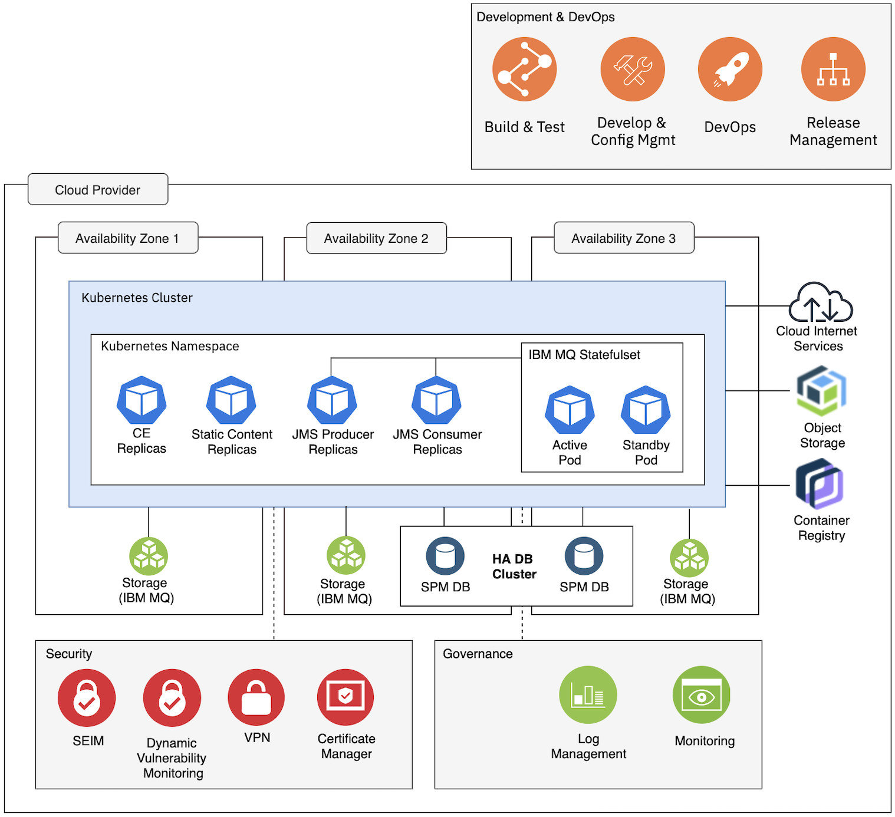
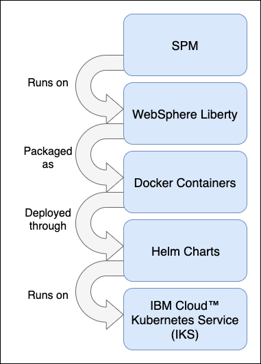

IBM® Cúram Social Program Management (SPM) is not a PaaS nor a SaaS offering on IBM Cloud. SPM is a platform for Social Programs that customers configure and customize according to their own requirements.
Then build, deploy, run and operate on environments according to their own Software Development Life Cycle (SDLC) requirements.

SPM can either be deployed on traditional hosting architectures (i.e. virtual machines or bare metal) or on Kubernetes. This runbook only refers to the cloud native hosting on Kubernetes.

SPM can be deployed on two Kubernetes distributions:

1. **IBM Cloud Kubernetes Services (IKS)**: only available on IBM Cloud.
2. **Red Hat OpenShift**: on any environment supported by Red Hat (e.g. on-premises, private cloud or public cloud).

The Figure 1 shows the essential nature of the SPM architecture on Kubernetes.

It conveys the governing ideas and major building blocks of the architecture.
The **"Development & DevOps"**, **"Security"** and **"Governance"** components and processes described in the architecture diagram are just for reference and will likely be different, depending on your Deployment Architecture.

SPM does not require nor impose these components in the architecture.

<InlineNotification>

**Note:** This runbook does not provide any content or guidance on the `Development and DevOps`, `Governance` or `Security`.

</InlineNotification>

<Caption>

*Figure 1:* SPM on Kubernetes

</Caption>

The Figure 2 shows how SPM is built as a containerized application by using WebSphere® Application Server Liberty, packaged as Docker®
containers, orchestrated by Helm, and running on IKS.

<Caption>

*Figure 2:* SPM packaging for Kubernetes

</Caption>

<InlineNotification>

**Note:** Database support remains on virtual machines (VMs) as part of the initial offering.

</InlineNotification>

<InlineNotification>

**Note:** IBM MQ running on Kubernetes is only supported on OpenShift. When deploying SPM on IBM Cloud Kubernetes Services, IBM MQ must be hosted on virtual machines or bare metal. More information about SPM and IBM MQ can be found [here](/supporting-infrastructure/mq/mq-overview).

</InlineNotification>

To support containerized architectures, a number of architectural changes were made. The changes are documented as follows and apply only to SPM running on
Kubernetes.

* [Message Architecture](https://www.ibm.com/docs/en/spm/8.0.0?topic=architecture-messaging)
  When IBM® Cúram Social Program Management is containerized, IBM MQ Long Term Support (LTS) is used as the message engine to process internal application
  JMS-based deferred processing.
* [Transaction Isolation](https://www.ibm.com/docs/en/spm/8.0.0?topic=architecture-transaction-isolation)
  Client HTTP initiated transactions and JMS initiated transactions run on different WebSphere Application Server Liberty instances, integrated through
  an external message engine (for example, IBM MQ).
* [Elasticity](https://www.ibm.com/docs/en/spm/8.0.0?topic=architecture-elasticity)
  Elasticity in IBM Cloud Kubernetes Service is the ability to scale up or down pods and nodes to adjust to the load to meet the end user demand.
