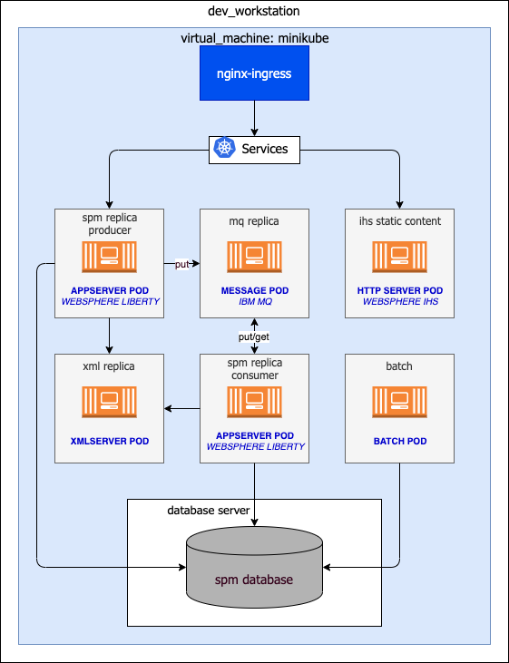
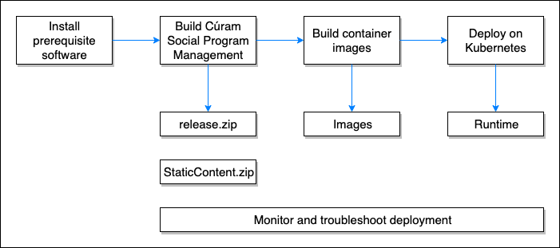

This runbook is designed for first-time users of Helm, Minikube, and Kubernetes.

Minikube is a variant of Kubernetes that runs a single-node cluster inside a virtual machine (VM) on your laptop.

The procedure that is described uses a minimal architecture, where the intent is to get you familiar with using the main artifacts needed to run IBM® Cúram Social Program Management (SPM)
 on Kubernetes. Figure 1 describes the example architecture:

<Caption>

*Figure 1:* Example dev workstation architecture

</Caption>

The architecture is defined by a Kubernetes environment (contained in a virtual machine) that is composed of the following elements:

* An IBM® WebSphere® Liberty based pod that contains the Cúram EAR file.
* A pod with an IBM MQ Server configured as the message engine to support JMS-based deferred processing in SPM.
* A pod that contains the XML server.
* A pod that runs batch processes.

This environment is linked to an external IBM Db2 or Oracle database.

For a Kubernetes cluster in a development environment this runbook uses [Minikube](/prereq/kubernetes/minikube).
Minikube can easily run on a developer computer, which is convenient for describing the application flow.
[CodeReady Containers](/prereq/openshift/codeready-containers) (CRC) can also be used to run a Kubernetes environment in a development environment.

Figure 2 describes the following development path.

* Create a build and deployment environment for SPM.
* Build SPM to deploy on Kubernetes on Minikube or CRC.
* Create the Docker® images for SPM.
* Deploy SPM Docker images to Kubernetes on Minikube or CRC.
* Troubleshoot SPM when deployed in Kubernetes.

<Caption>

*Figure 2:* Process summary

</Caption>

<InlineNotification>

**Note:** The implementation of SPM that is described in this runbook uses only the following .ear files:

* Curam.ear
* CuramServerCode.ear

The scripts can be easily extended to include the other SPM applications, such as Rest or Citizen Portal.

</InlineNotification>

The runbook makes the following assumptions:

* Steps to build the SPM containers and run Minikube or CRC are done on a Red Hat or OSX development machine.
* Steps related to [Building the IBM Cúram Social Program Management application](/deploy-spm/build-spm) can be executed on a separate machine.
* Base knowledge of the Linux command line for navigating folders.
