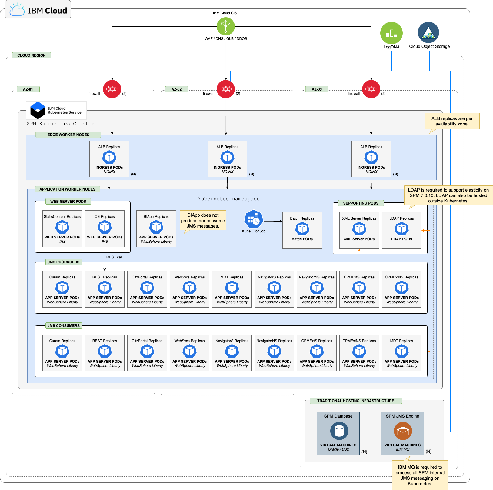

## SPM Kubernetes cluster - Reference Architecture

The deployment architecture overview in this section represents how IBM® Cúram Social Program Management (SPM) should be deployed into IKS.
This architecture allows SPM to leverage the benefits of flexibility, elasticity, efficiency and the strategic value offered by cloud native architecture.

<Caption>

*Figure 1:* SPM on Kubernetes - deployment architecture

</Caption>

* SPM deployed in WebSphere Liberty, lightweight JavaEE application server, designed for Kubernetes.
* EAR files deployed in their own Liberty instance.
* Liberty instances packaged in Docker images, which are run as Docker containers.
* Batch packaged as Docker images, which are run as containers.
* XML Server packaged as Docker images, which are run as containers.
* SPM only supports SPM Docker containers when deployed into Kubernetes pods.
* JMS messaging engine deployed separately using IBM MQ, managed through Helm charts.
* Database and IBM MQ deployed on VM.
  * Deployment of database on bare metal and VMs will still be supported when application tier is running in Kubernetes.
  * SPM only supports IBM MQ hosted on bare metal and VMs.
  * Keep the database and queue managers tier close to the application tier to reduce latency.
