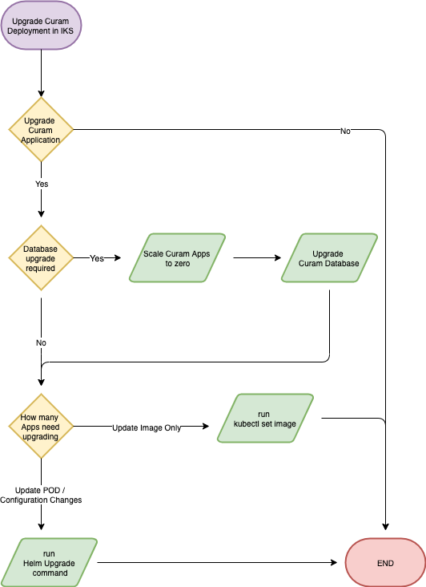

One of the benefits of IBM® Cúram Social Program Management (SPM) on Kubernetes is the reduced time required to roll out a new version of your application from development all the way to production.

Depending on the type of change that needs to be made, there are multiple options for rolling out the change. The different options are visualized in figure 1.


<Caption>

*Figure 1:* Upgrade process flow

</Caption>

All the application images should be built by a continuous integration environment, tagged appropriately (e.g. combination of product version and a timestamp), and then promoted throughout all the phases.

Updates can be applied using 2 ways: Helm values, or by editing the deployed resources using `kubectl`.

## Updating with `kubectl`

You can update a running application by using the following command to switch out an image, Kubernetes takes care of everything else.
A new pod with the new image is started up, and when it reports as 'Ready', it takes over serving traffic.

```bash
kubectl set image deployment/<deploymentName> <containerName>=<newImage>:<newTag>
```

This process is described in greater detail in [Updating a Deployment](https://kubernetes.io/docs/concepts/workloads/controllers/deployment/#updating-a-deployment).

For example, the following command will issue an instruction to the Kubernetes Master to change the image used by the `apps-producer-rest` container of a deployment called `myRelease-apps-rest-producer` to `minikube.local:5000/rest:vNext`

```bash
kubectl set image deployment/myRelease-apps-rest-producer apps-producer-rest=minikube.local:5000/rest:vNext
```

The status of this change can be monitored using `kubectl get pods --watch` or `kubectl rollout status deployment/myRelease-apps-rest-producer`

If the rollout is not successful (for example, becasue of a typo), the last update can be rolled back:

```bash
kubectl rollout undo deployment/<deploymentName>
```

This is convenient when only a single image needs to be updated, and the changes do not require any database changes (for example, the Universal Access React application would be a good candidate).
However, bulk updates of images or configuration should be handled with Helm.

## Rolling out updates with Helm

An update using Helm can include configuration changes, as well as a change of Docker® images. Assuming that all images are tagged with the same tag, the upgrade command would look like the following example:

```bash
helm upgrade <releasename> <chartName> --reuse-values --set images.tag=vNext
```

The `helm upgrade` command keeps all the values used with the original `helm install` due to the `--reuse-values` flag, and only changes the `images.tag` value, so all new images are deployed with the `vNext` tag.

Like `kubectl`, if you must reverse any configuration changes applied by the last action, use `helm rollback <releasename>`.

The full documentation of the `helm upgrade` command is available on the Helm [Updating a Deployment](https://helm.sh/docs/helm/helm_upgrade/) page.

## Upgrade with SQL changes

Both of the scenarios described assume a no-impact, zero-downtime upgrade, that is no changes to the database are required.
However, should the rollout include schema changes, the application must be halted. This must be coordinated together with your IT Operations and DBA teams.

To halt the application for the duration of the upgrade without deleting all Kubernetes objects, the application can be scaled down to 0 pods:

```bash
kubectl scale --replicas=0 deployment/<deploymentName>
```

After the database upgrade is completed, the new version of application code can be rolled out using the Helm method described in
[Rolling out updates with Helm](#rolling-out-updates-with-helm).

<InlineNotification>

**Note:** The `kubectl scale` command can be used to horizontally [scale your application](https://kubernetes.io/docs/concepts/workloads/controllers/deployment/#scaling-a-deployment).

</InlineNotification>
