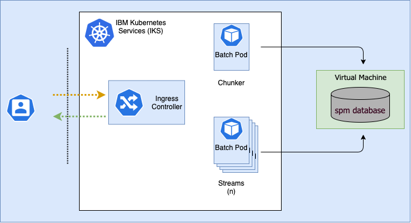

## How batch streaming is deployed in Kubernetes

IBM® Cúram Social Program Management (SPM) on Kubernetes supports a different model for batch processing in IKS, where, as outlined earlier, SPM batch processing can be built and deployed into its own pod.
By running SPM batch processing in its own pod, the pod can leverage the benefits of flexibility, elasticity, efficiency and the strategic value offered by cloud native architecture.

### What is batch streaming?

The batch streaming infrastructure provides a straightforward mechanism to implement a batch process so that it can be run in parallel (streams) across multiple pods.
For example, if we wanted to issue payments, the chunker identifies all the cases to be paid and the stream would process a case and issue the payments that are due.


<Caption>

*Figure 1:* SPM batch processing on kubernetes

</Caption>

<InlineNotification>

**Note:** For more information, see [Batch Streaming Architecture](https://www.ibm.com/docs/en/spm/8.0.0?topic=details-additional-information)

</InlineNotification>

## Setting up Batch Streaming with Helm

Streamed jobs may be scheduled using Helm the same way as standalone Batch jobs.

In your override values file, add a section under the `batch.streamed` key for each of the streamed jobs to be scheduled.

```yaml
batch:
  streamed:
    cash_reassessment:
      schedule: "0 1 * * *"
      chunker:
        className: curam.core.sl.infrastructure.assessment.intf.CREOLEBulkCaseChunkReassessmentByProduct.process
        parameters: productID=4100
        replicaCount: 1
      stream:
        className: curam.core.sl.infrastructure.assessment.intf.CREOLEBulkCaseChunkReassessmentStream.process
        replicaCount: 1
    food_reassessment:
      schedule: "0 2 * * */2"
      chunker:
        className: curam.core.sl.infrastructure.assessment.intf.CREOLEBulkCaseChunkReassessmentByProduct.process
        parameters: productID=4200
        replicaCount: 1
      stream:
        className: curam.core.sl.infrastructure.assessment.intf.CREOLEBulkCaseChunkReassessmentStream.process
        replicaCount: 1
```

This example schedules Cash Assistance bulk reassessment to run at 1 AM every night, and Food Assistance bulk reassessment to run at 2 AM every second night.

The `cash_reassessment` and `food_reassessment` keys have no special meaning - their purpose is to provide separate definitions of different batch jobs.
These keys are used in names of the CronJob objects, e.g. `<releaseName>-batch-food-reassessment-chunker` and `<releaseName>-batch-food-reassessment-stream`

A complete list of configurable options for the chunkers and streams is available on the Helm [Configuration Reference](/deployment/config-reference#batch-jobs) page.

## Ad-hoc execution of Batch Streaming jobs

An example for the steps required to set up Batch Streaming is outlined as follows.
This example uses the bulk reassessment of food assistance case types.

The first stage is to set up a new YAML file for the streaming and chunking batch processing.

<InlineNotification>

**Note:** No SPM default installation settings were changed.

</InlineNotification>

```shell
kubectl create job --from=cronjob/${release_name}-batch-queued \
       -n $namespace -o yaml --dry-run=client process_name > process_name.yaml
```

Where:

* `namespace` is the namespace where you want to run the batch processing
* `release_name` is the name of the release you are using
* `process_name` is the name of the batch process you are creating

You should also create a new file for each process, for example `stream_foodassistance.yaml`, and `chunker_foodassistance.yaml`

A corresponding YAML file is created. Open it with your preferred editor and add the following lines to the `spec.template.spec.containers[0]` section:

<Tabs>

<Tab label="Chunker">
<Row>
<Column>

```yaml
args:
- -Dbatch.program=curam.core.sl.infrastructure.assessment.intf.CREOLEBulkCaseChunkReassessmentByProduct.process
- -Dbatch.parameters="productID=4200"
```

**Note:** The `args` key should become a sibling of the `command` key.

</Column>
</Row>
</Tab>

<Tab label="Stream">
<Row>
<Column>

```yaml
args:
- -Dbatch.program=curam.core.sl.infrastructure.assessment.intf.CREOLEBulkCaseChunkReassessmentStream.process
```

**Note:** The `args` key should become a sibling of the `command` key.

</Column>
</Row>
</Tab>

</Tabs>

You should now have YAML files for a chunker and streamer for bulk reassessment of food assistance case types.

<InlineNotification>

Newer versions of `kubectl` add a `metadata.ownerReferences` field to the output of `kubectl create job --from=...`.
This field must be removed before creating the new jobs from these YAML files.

</InlineNotification>

### Running batch streaming yaml files

To orchestrate the batch process, run the following command and repeat for the chunker and streamer.

```shell
kubectl create -f stream_foodassistance.yaml -n $namespace
kubectl create -f chunker_foodassistance.yaml -n $namespace
```

### Post batch processing

The batch pods that are created for batch streaming are on demand.

When the batch processes finish, the pods remain in a `completed` state.
While this does not consume CPU or Memory resources on the worker nodes of your cluster, this may place added pressure on the Kubernetes API server

<InlineNotification>

A [TTL Controller for Finished Resources](https://kubernetes.io/docs/concepts/workloads/controllers/ttlafterfinished/) is available in Kubernetes, which will automatically clean up any completed pods after a specified length of time.
However, this feature is in Alpha state and has to be enabled using a feature flag on both the `kube-apiserver` and `kube-controller-manager`.

**Note:** It is not recommended to use Alpha features in a production environment.

</InlineNotification>
