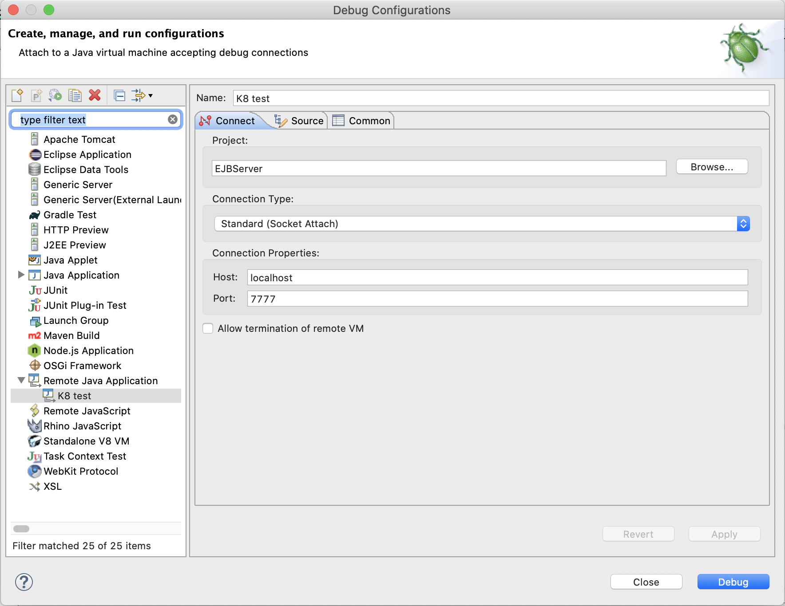

## Remote debugging

It might be necessary to use a remote debugger to step through code execution on the cluster, where log analysis does not provide sufficient information to resolve an issue.
The following is an outline of the steps required to connect eclipse's remote debugger to the IBM® Cúram Social Program Management (SPM) code running on the cluster.

* Edit the Cúram Producer deployment spec to pass debug arguments to the WebSphere® Liberty server.
* Forward the debugging port from the port running the Cúram Producer pod.
* Create the remote debug configuration in eclipse.
* Connect the remote debugger to the listener.

### Edit the Cúram Producer deployment

Edit the deployment spec for the Cúram Producer deployment.

```kubectl edit deployment release-apps-curam-producer```

Add the following lines under `.spec.template.spec.containers`:

<InlineNotification>

**Note:** Under `.spec.template.spec.containers` we can define multiple containers. The top level indented hyphen character preceding args
signifies the start of *a* container definition, remove the `-` at the same indentation level before env section or they will be treated
as two separate container definitions, with one being invalid.

</InlineNotification>

<Tabs>

<Tab label="Correct Example">
<Row>
<Column>

```
containers:
- args:
  - /opt/ibm/wlp/bin/server
  - debug
  - defaultServer
  env:
  ...
  ...
```

</Column>
</Row>
</Tab>

<Tab label="Incorrect Example">
<Row>
<Column>

```
containers:
- args:
  - /opt/ibm/wlp/bin/server
  - debug
  - defaultServer
- env:
  ...
  ...
```

</Column>
</Row>
</Tab>

</Tabs>

The Cúram Producer deployment will terminate its pod and start a new one with the debug configuration.

### Forward the debugging port

Next, forward the WebSphere® Liberty server's debug port to make it available to the remote debugger. 7777 is the default debug port for WebSphere® Liberty.

```kubectl port-forward release-apps-curam-producer-XXXX 7777:7777```

### Create the remote debug configuration

From the Eclipse debug view, create a Java Remote Application. Attach an appropriate source code project, and attach the Java Remote Application to the port you forwarded in [Forward the debugging port](#forward-the-debugging-port).
The `Host` field in the debug configuration will be `localhost` even if you are using a remote cluster because the port forwarding
relies on the local loopback device.


<Caption>

*Figure 1:* Example debugger config

</Caption>

### Connect the remote debugger to the listener

Launch the debugger and debug as usual.
